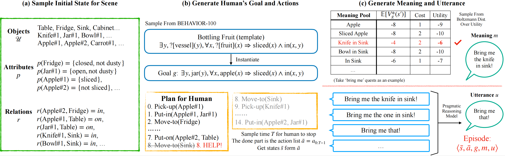

# HandMeThat: Human-Robot Communication in Physical and Social Environments

This is the code used to generate HandMeThat Dataset and evaluate agents on it.

<div align="center">
  
</div>


**[HandMeThat: Human-Robot Communication in Physical and Social Environments
](https://proceedings.neurips.cc/paper_files/paper/2022/hash/4eb33c53ed5b14ce9028309431f565cc-Abstract-Datasets_and_Benchmarks.html)**

[Yanming Wan*](https://sites.google.com/view/wanyanming), 
[Jiayuan Mao*](http://jiayuanm.com), and
[Joshua B. Tenenbaum](https://web.mit.edu/cocosci/josh.html)

[[Paper]](https://proceedings.neurips.cc/paper_files/paper/2022/file/4eb33c53ed5b14ce9028309431f565cc-Paper-Datasets_and_Benchmarks.pdf)
[[Supplementary Material]](https://proceedings.neurips.cc/paper_files/paper/2022/file/4eb33c53ed5b14ce9028309431f565cc-Supplemental-Datasets_and_Benchmarks.pdf)
[[Project Page]](http://handmethat.csail.mit.edu)
(* indicates equal contributions.)

## Prerequisites

### Install Source
Clone this repository:
```bash
git clone https://github.com/Simon-Wan/HandMeThat
```

Clone the third party repositories ([XTX](https://sites.google.com/princeton.edu/xtx), [ALFWorld](https://alfworld.github.io/)):
```bash
git clone https://github.com/princeton-nlp/XTX.git
git clone https://github.com/alfworld/alfworld.git
```
Add the packages to your `PYTHONPATH` environment variable.
```bash
export PYTHONPATH=.:$PYTHONPATH:<path_to_xtx>:<path_to_alfworld>
```

### Create a Conda Environment
Create a conda environment for HandMeThat, and install the requirements.
```bash
conda create -n hand-me-that python=3.9
conda activate hand-me-that
conda install pytorch torchvision torchaudio cudatoolkit=11.3 -c pytorch
conda install numpy scipy pyyaml networkx tabulate
conda install h5py tqdm click transformers
conda install -c conda-forge importlib_metadata
pip install jericho lark textworld opencv-python ai2thor jacinle
python -m spacy download en_core_web_sm
```
This includes the required python packages from the third-party repositories.


### Prepare the HandMeThat Dataset
Download the version 1 (V1) dataset from [Google Drive link
](https://drive.google.com/file/d/1QoCL5veGnuJNhK1mMDryCrvpwVXTupdI/view?usp=sharing) and place the zipped file at `./datasets/v1`.


Unzip the dataset so that `./data/HandMeThat_with_expert_demonstration` is a folder containing 10,000 json files.
The data split information is presented in `./data/HandMeThat_data_info.json`.

Download the version 2 (V2) dataset from [Google Drive link] and place the zipped file at `./datasets/v2`.

Unzip the dataset so that `./data/HandMeThat_with_expert_demonstration` is a folder containing ***** json files.
The data split information is presented in `./data/HandMeThat_data_info.json`.

## Quickstart

Play a HandMeThat game:
```python
from data_generation.text_interface.jericho_env import HMTJerichoEnv
import numpy as np
step_limit = 40
dataset = './datasets/v2/HandMeThat_with_expert_demonstration'
eval_env = HMTJerichoEnv(dataset, split='test', fully=False, step_limit=step_limit)
obs, info = eval_env.reset()
print(obs.replace('. ', '.\n'))
for _ in range(step_limit):
    action = input('> ')
    # uncomment the following part to get started with a random agent instead
    # _ = input('Press [Enter] to continue')
    # action = np.random.choice(info['valid'])
    # print('Action:', action)
    obs, reward, done, info = eval_env.step(action)
    print(obs.replace('. ', '.\n'), '\n\n')
    if done:
        break
print('moves: {}, score: {}'.format(info['moves'], info['score']))
```
Run `python main.py` to execute the quickstart code.


## Dataset Generation

To generate HandMeThat dataset:
```bash
python data_generation/generation.py --num 1000 --quest_type bring_me
```

To generate HandMeThat data on some particular goal, use the argument --goal to specify the goal index.


### Configure the Sampling Space
1. The object hierarchy and initial position sampling space are specified in text files.
2. All current goals are listed in `./data_generation/sampling/goal_sampling.py`, and new goals can be specified using the given templates.
3. To specify the number of objects in each category, please refer to the code.

### Differences between V1 and V2 Datasets
1. V2 Only contain the tasks on 25 selected goal templates, that are more easily predictable by humans.
2. V2 Only contain "bring me" type instructions, and mainly focus on pick-and-place tasks.
3. We generate more data on each specific goal.
4. We add "subgoal" to each data piece, which is a FOL sequence corresponding to the wanted actions, and the information can be used in goal inference.
5. We revise the process of random truncation of human trajectory as well as how human generate an utterance, to ensure that most of the generated tasks are human-solvable.


## Baseline Models Training and Evaluation

This current release contains the basic training setting for Seq2Seq, DRRN, and offline-DRRN models. 
The models can be evaluated on validation and test split.

We tested each model on both fully- and partially-observable setting on all four hardness levels. 
These experiment results are presented in the main paper and supplementary materials. 
The hyperparameter we used are the default values in this released repository.

### DRRN / offline-DRRN

To train the model (e.g., 'DRRN' with 'fully' observable setting):
```bash
python scripts/train_rl.py --model DRRN --observability fully
```

To evaluate the model (e.g., validate) on specific hardness level (e.g., level1):
```bash
python scripts/eval_rl.py --model DRRN --observability fully --level level1 --eval_split validate --memory_file memory_5 --weight_file weights_5
```

Use `--model offlineDRRN` for offline-DRRN setting.

### Seq2Seq

To train the model (e.g., 'partially' observable setting):
```bash
python scripts/train_seq.py --observability partially
```

To evaluate the model (e.g., test) on specific hardness level (e.g., level1):
```bash
python scripts/eval_seq.py --observability partially --level level1 --eval_split test --eval_model_name weights_50000.pt
```

### Random Agent

To evaluate the random agent:

```bash
python scripts/eval.py --agent random --level level1 --eval_split test
```